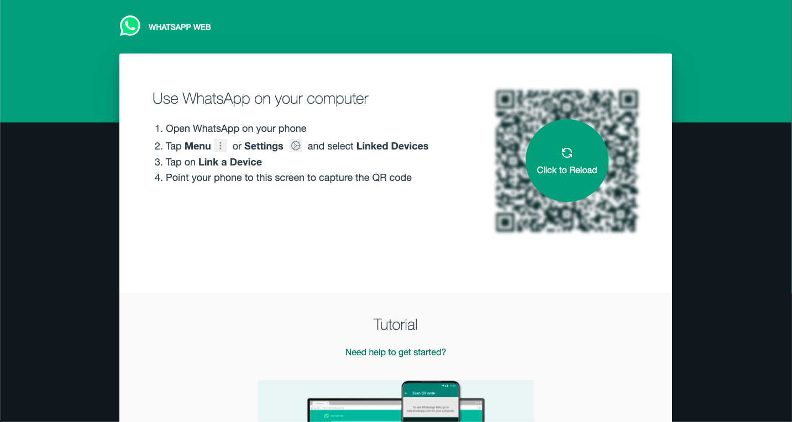
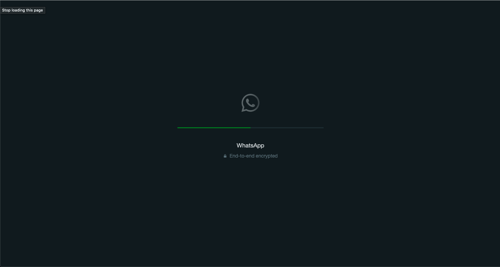
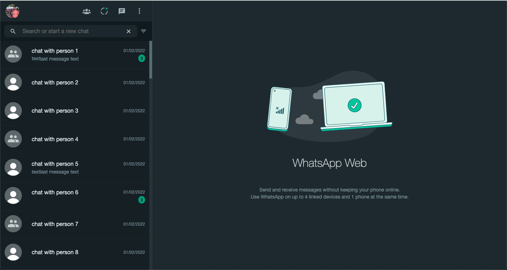
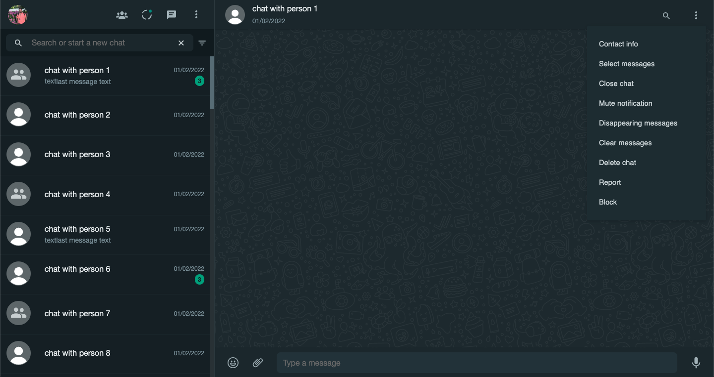
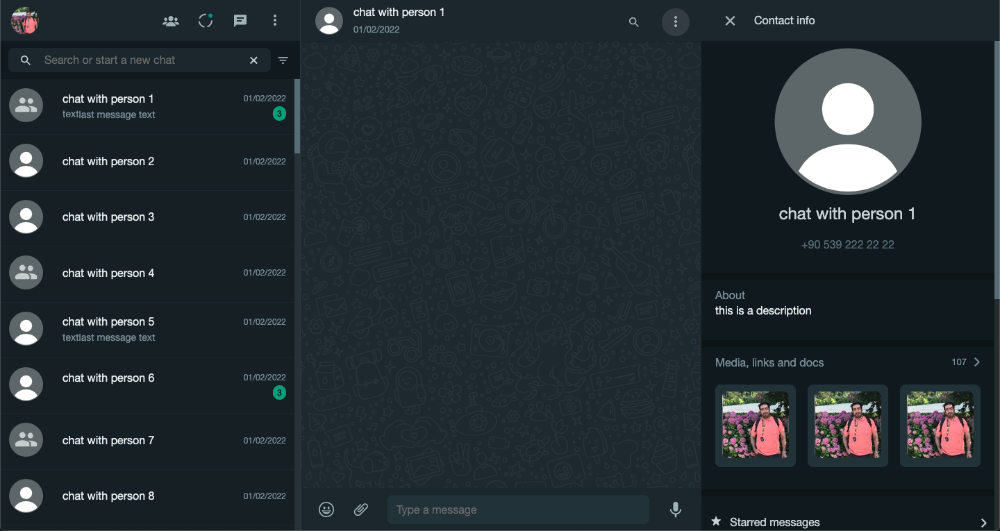

# WhatsppWeb Clone with React with Node.js

This project is the frontend part of WhatsappWeb which is a pixel perfect clone of the original Whatsapp web

The backend can be integrated to any whatspp engine providers such as:
 - [whatsapp-web.js](https://github.com/pedroslopez/whatsapp-web.js/)
 - [Baileys](https://github.com/WhiskeySockets/Baileys)

This project implemented *whatsapp-web.js* as the wa engine.
[Whatsapp-clone-backend](https://github.com/navid-kianfar/whatsapp-clone-backend)

### a docker image will be created when the project is stable but untill then: run the following:

```sh
mkdir whatsapp-clone
cd whatsapp-clone
git clone https://github.com/navid-kianfar/whatsapp-clone-frontend.git
git clone https://github.com/navid-kianfar/whatsapp-clone-backend.git

cd whatsapp-clone-backend
npm install && npm start

```

open another terminal and

```sh

cd whatsapp-clone-frontend
npm install && npm start
```

head to [http://localhost:3000](http://localhost:3000)

after redirecting to auth page, scan the qr code with your phone.



and you are in! :D



to keep the privacy the following screen shots are with fake data



